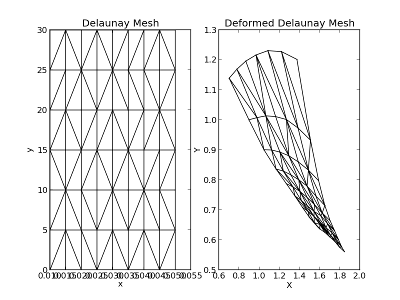
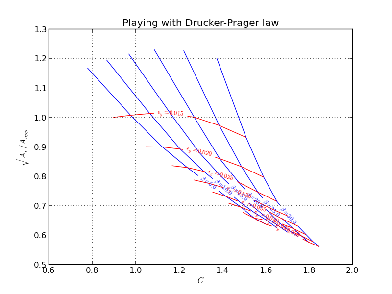

Advanced Examples
==================

Here we show some fancier examples using the tools available in abapy all together.

Indentation
-----------

2D / 3D , multi material indentation
_______________________________________

All files used in this example are available in ``doc/advanced_examples/indentation/simulations``

In this example, we focus on the indentation behavior of an elastic-plastic (von Mises) sample indented by an axisymmetric cone. To build this example, we first need to create 2 classes: ``Simulation`` and ``Database_Manager`` as follows in the file :download:`classes.py <advanced_examples/indentation/simulations/classes.py>`:

.. literalinclude:: advanced_examples/indentation/simulations/classes.py

Then we need to define some basic settings here :download:`settings.py <advanced_examples/indentation/simulations/settings.py>`:

.. literalinclude:: advanced_examples/indentation/simulations/settings.py

Then we can load simulations request in the SQLite database :download:`settings.py <advanced_examples/indentation/simulations/loader.py>`:

.. literalinclude:: advanced_examples/indentation/simulations/loader.py

After executing loader, we see that all simulation have been entered in the database:

>>> execfile('loader.py')

Then we just launch the simulations using :download:`launcher.py <advanced_examples/indentation/simulations/launcher.py>`:

.. literalinclude:: advanced_examples/indentation/simulations/launcher.py

>>> execfile('launcher.py')

And now after these fast simulations it's time to collect some results or perform some reverse analysis. Here is a very brief example of ploting :download:`basic_plot_DP.py <advanced_examples/indentation/simulations/basic_plot_DP.py>`:

.. literalinclude:: advanced_examples/indentation/simulations/basic_plot_DP.py

